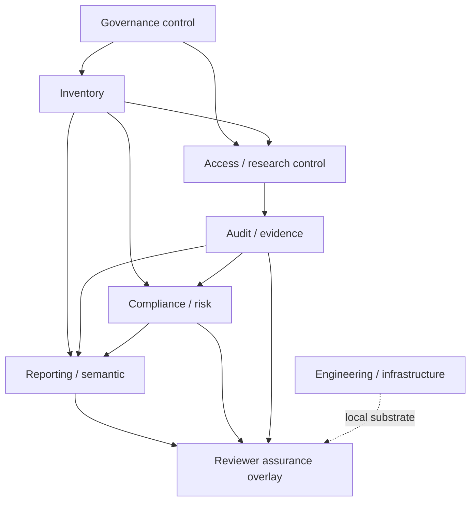

# Healthcare AI Governance & Secure Research Platform

An architecture-first portfolio project for governing synthetic healthcare AI and secure-research
workflows: inventory, access, audit, evidence, compliance, risk, reporting, and reviewer assurance.
The repository demonstrates a complete local review path from deterministic source state to
evidence-linked findings and offline verification.

> **Boundary:** Synthetic data only. This is local, read-only, synthetic-data-only, and
> non-production. It does not
> connect to a real healthcare organisation, patient data, Snowflake account, Microsoft Fabric
> tenant, Power BI workspace, identity system, or live cloud infrastructure. It does not claim
> certification, organisational approval, or production deployment.

## Architecture

The platform has seven governance planes, with a reviewer-assurance overlay across them:

- **Governance control:** policy and control definitions
- **Inventory:** datasets, models, and research projects
- **Access / research control:** request, decision, grant, expiry, and revocation simulation
- **Audit / evidence:** append-only events, correlation, and evidence packs
- **Compliance / risk:** deterministic controls, bounded risk indicators, and posture
- **Reporting / semantic:** KPIs, snapshots, and executive summaries
- **Engineering / infrastructure:** Python, Docker, Terraform, CI, and future platform design
- **Reviewer assurance overlay:** portal, policy traceability, drift, readiness, archive, and final
  assurance outputs



See [reports/architecture.md](reports/architecture.md) for the full architecture, boundaries,
and future integration design.

## Implemented vs. Planned

### Implemented locally

- Deterministic synthetic dataset, model, and research-project inventory
- Access request -> decision -> grant lifecycle with expiry and revocation scenarios
- Append-only audit and evidence generation with traceable identifiers
- Compliance controls, findings, bounded risk scoring, and governance posture
- Reporting and KPI snapshot layer
- Read-only Streamlit reviewer portal with filters and drill-through
- Policy/control catalog and control-to-evidence traceability
- Assurance snapshots, control/risk drift, and integrated review pack
- Review-readiness and demo validation
- Offline SHA-256 archive manifest and read-only verification
- Full deterministic portfolio assurance pipeline

### Planned / intentionally not implemented

- Live Snowflake integration, schemas, RBAC, and query-history ingestion
- Entra ID, production authentication, and live identity provisioning
- Microsoft Purview, SIEM, or other external audit integrations
- Fabric semantic-model deployment and Power BI deployment
- Production hosting, live monitoring, alerting, and enterprise observability
- Automated approvals, remediation, workflow execution, or notifications
- Digital signing, external attestation, regulatory certification, or organisational approval

## Technology stack

Implemented locally: Python 3.11+, Pydantic, PyYAML, Streamlit, pytest, Ruff, JSON/CSV/Markdown
generation, Docker development support, and GitHub Actions quality gates.

Future architecture is documented for Snowflake, Fabric, Power BI, Terraform providers, identity,
and policy-as-code integrations. Those integrations are not required to run this repository.

## Repository structure

```text
src/governance_platform/
  inventory/       Inventory entities, generation, validation, and I/O
  access/          Access and research-control simulation
  audit/           Audit log, evidence, completeness, and reporting
  compliance/      Controls, risk, policy catalog, and assurance history
  reporting/       Governance KPIs and reporting snapshots
  reviewer/        Portal data, exports, assurance packs, readiness, and archive helpers
  reviewer_app.py  Local read-only Streamlit entrypoint

governance/        Governance and control documentation
docs/              ADRs and demo documentation
reports/           Architecture and diagrams
fabric/            Future Fabric / Power BI design
infrastructure/    Docker, Terraform, and Snowflake design
scripts/           Generation, verification, smoke, and assurance entrypoints
tests/             Automated behavioral tests
outputs/           Reproducible generated artifacts; gitignored
```

## Quick start

```bash
python3 -m venv .venv
source .venv/bin/activate
pip install -e ".[dev]"

python3 scripts/run_portfolio_assurance.py
```

The assurance entrypoint runs the complete generation chain, archive verification, lint, format,
tests, repository validation, and reviewer smoke checks. It writes the final summary to
`outputs/final/`.

Launch the local portal after generation:

```bash
streamlit run src/governance_platform/reviewer_app.py
```

Individual generators are documented in [outputs/README.md](outputs/README.md) and the
[reviewer demo runbook](docs/demo/reviewer-demo-runbook.md).

## Reviewer workflow

```text
Generate assurance outputs
  -> Launch reviewer portal
  -> Review posture and findings
  -> Trace controls to evidence
  -> Inspect assurance drift
  -> Verify review readiness
  -> Verify offline archive
```

Start with [docs/demo/reviewer-demo-runbook.md](docs/demo/reviewer-demo-runbook.md). It contains
the deterministic walkthrough, example identifiers, drill-through paths, shutdown steps, and
claim boundaries. The blank notes template is
[docs/demo/reviewer-walkthrough-template.md](docs/demo/reviewer-walkthrough-template.md).

## Key documentation

- [Architecture](reports/architecture.md)
- [Architecture decision records](docs/architecture/decisions/)
- [Governance operating model](governance/README.md)
- [Policy and control catalog](governance/controls/README.md)
- [Generated output conventions](outputs/README.md)
- [Reviewer demo runbook](docs/demo/reviewer-demo-runbook.md)
- [Reviewer portal](src/governance_platform/reviewer_app.py)

## Generated assurance artifacts

The generated outputs are intentionally concise and reviewer-oriented:

- [Inventory outputs](outputs/README.md#inventory-outputs)
- [Access outputs](outputs/README.md#access-outputs)
- [Evidence outputs](outputs/README.md#evidence-outputs)
- [Compliance outputs](outputs/README.md#compliance-outputs)
- [Reporting outputs](outputs/README.md#reporting-outputs)
- [Reviewer export and demo handoff](outputs/README.md#reviewer-export-and-demo-handoff)
- [Policy/control catalog](outputs/README.md#policy-and-control-catalog-outputs)
- [Assurance history and drift](outputs/README.md#assurance-history-and-drift-outputs)
- [Integrated assurance review pack](outputs/README.md#integrated-assurance-review-pack-outputs)
- [Review readiness](outputs/README.md#reviewer-acceptance-and-demo-readiness-outputs)
- `outputs/archive/` — SHA-256 manifest, validation, checksums, and offline guide
- `outputs/final/` — final portfolio assurance summary

The canonical local result is a deterministic synthetic governance state, not evidence of a real
organisation or production system.

## Inventory outputs

Deterministic inventory artifacts are generated by the assurance pipeline and documented in
[outputs/README.md](outputs/README.md).

## Access outputs

Deterministic access requests, decisions, grants, expiry, and revocation artifacts are documented
in [outputs/README.md](outputs/README.md).

## Evidence outputs

Audit events, correlation, completeness, and evidence-pack artifacts are documented in
[outputs/README.md](outputs/README.md).

## Compliance outputs

Control results, bounded risk indicators, posture, and compliance reports are documented in
[outputs/README.md](outputs/README.md).

## Reporting outputs

Governance KPIs, reporting snapshots, and executive summaries are documented in
[outputs/README.md](outputs/README.md).

## Reviewer export and demo handoff

Briefing, evidence-index, and saved reviewer-view artifacts are documented in
[outputs/README.md](outputs/README.md) and [the demo runbook](docs/demo/reviewer-demo-runbook.md).

## Policy and control catalog outputs

Policy metadata, control catalog, and control-to-evidence traceability are documented in
[governance/controls/README.md](governance/controls/README.md) and [outputs/README.md](outputs/README.md).

## Assurance history and drift outputs

Explicit snapshots, control/risk drift, and reviewer change reports are documented in
[reports/architecture.md](reports/architecture.md) and [outputs/README.md](outputs/README.md).

## Integrated assurance review pack outputs

The integrated finding, policy, control, evidence, and drift pack is documented in
[outputs/README.md](outputs/README.md).

## Reviewer acceptance and demo readiness outputs

Acceptance criteria, artifact completeness, and demo-readiness evidence are documented in
[outputs/README.md](outputs/README.md).

## Validation

The normal quality gates are:

```bash
python3 -m ruff check .
python3 -m ruff format --check .
python3 -m pytest -q
python3 scripts/validate_repository.py
python3 scripts/verify_offline_archive.py
```

The full path is `python3 scripts/run_portfolio_assurance.py`. It is safe to rerun and does not
require credentials or external services.

## Limitations

This repository is a local portfolio demonstration. It does not provide live data access,
authentication, production RBAC, deployment, hosting, monitoring, alerting, remediation, external
attestation, regulatory interpretation, certification, or human approval. Matching archive
checksums prove byte equality with selected files; they do not prove authenticity, correctness, or
production readiness.

For the exact implemented/planned boundary, read [reports/architecture.md](reports/architecture.md),
[governance/README.md](governance/README.md), and the demo runbook.

## Explicit non-goals

No live Snowflake, Fabric, Power BI, Purview, Entra ID, SIEM, cloud deployment, public hosting,
authentication, production monitoring, automatic remediation, workflow approvals, digital signing,
external attestation, regulatory certification, or organisational sign-off is implemented.
