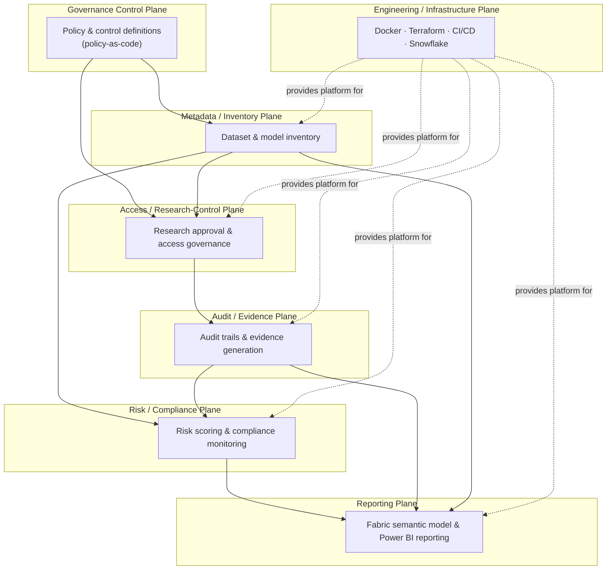

# Platform Architecture

**Status:** Milestone 1 (Platform Foundation), Milestone 2 (Synthetic Research & AI Inventory),
Milestone 3 (Access & Research Control Plane), Milestone 4 (Audit & Evidence Plane), Milestone 5
(Risk & Compliance Monitoring Plane), Milestone 6 (Governance Reporting & Semantic Plane),
Milestone 7 (Local Governance Reviewer Portal), Milestone 8 (Reviewer Export & Demo
Handoff), Milestone 9 (Policy & Control Catalog), Milestone 10 (Control Assurance History &
Drift), Milestone 11 (Integrated Assurance Review Pack), and Milestone 12 (Reviewer Acceptance &
Demo Readiness). This document describes the target architecture for the full platform and marks,
plane by plane, what exists today versus what is designed but not yet built. Nothing described as
"Planned" should be treated as available.

**Data statement:** the platform is designed to operate on synthetic data only. No real patient
data, no production Snowflake account, no Fabric tenant, and no live cloud infrastructure exist
behind this repository.

## Why seven planes

Healthcare AI governance spans concerns that fail independently and are owned by different
people — a data engineer maintaining inventory metadata does not carry the same responsibility as
a compliance officer reviewing access, and neither owns the reporting layer an oversight
committee reads. Splitting the platform into planes keeps those concerns modular: each plane has
one job, a clear owner, and a boundary that later milestones can implement, test, and deploy
independently without destabilizing the others.

## The seven planes

### 1. Governance control plane

Owns policy and control definitions as code: what a "dataset," a "model," an "approved research
project," and a "control" mean; what rules govern them; what constitutes a violation. Every other
plane reads its definitions from here rather than hard-coding them.

- **Status:** Planned. Only architectural placement and the policy-as-code ADR exist today.
  Milestone 9 adds a local policy/control catalog over implemented compliance controls, but it is
  metadata and traceability inside the current local risk/compliance layer — not a full governance
  control plane, generic policy DSL, or live enforcement platform.

### 2. Metadata / inventory plane

The system of record for datasets and models: what exists, who owns it, its sensitivity
classification, its lineage, and its lifecycle state. This is the plane every other plane joins
against — access decisions, audit records, and risk scores all reference an inventory entity.

- **Status:** Implemented (Milestone 2), as a local, code-defined system of record — not yet the
  Snowflake-backed platform ADR
  [0003](../docs/architecture/decisions/0003-snowflake-as-future-governed-platform.md) designates
  as its eventual home. `src/governance_platform/inventory/` provides typed, pydantic-validated
  Dataset, AIModel, and ResearchProject entities; an `InventoryPortfolio` enforcing cross-entity
  referential integrity (no duplicate IDs, no dangling dataset/model references); deterministic
  synthetic generation of a restrained six-dataset/five-model/four-project portfolio; JSON/CSV
  export and load; and an aggregate governance summary. See the root
  [README's Inventory outputs section](../README.md#inventory-outputs) for entity fields, output
  locations, and limitations. Still not implemented: any persistent backing store, model
  training/deployment/inference, research workspace provisioning, or approval-workflow automation
  — those remain the concern of the access/research-control, risk/compliance, and engineering/
  infrastructure planes below.

### 3. Access / research-control plane

Governs who may access which dataset or model for which approved research purpose: request
intake, approval workflow, time-bounded grants, and periodic access recertification.

- **Status:** Implemented (Milestone 3), as a **local governance simulation** — not live identity
  or Snowflake RBAC enforcement. `src/governance_platform/access/` provides typed, immutable
  AccessRequest, ApprovalDecision, and AccessGrant entities; deterministic eligibility evaluation
  against the Milestone 2 inventory (`policy.py`) covering project existence/approval/expiry,
  dataset/model existence, project linkage, research-use permission, dataset/model approval state,
  and requested-duration-vs-project-expiry; an `AccessControlService` orchestrating
  request → decision → grant → revocation/expiry, with grant activity always computed from an
  explicitly supplied evaluation instant, never the system clock; an `AccessControlPortfolio`
  enforcing the access plane's own referential integrity (no duplicate IDs, no grant without an
  approved decision); deterministic synthetic scenario generation; JSON/CSV export and load; and
  an aggregate access-review summary. See the root
  [README's Access outputs section](../README.md#access-outputs) for the full rule list, output
  locations, and limitations. Still not implemented: periodic recertification, any persistent
  backing store, authentication, real user accounts, or any live Snowflake/Entra ID/cloud identity
  integration.

### 4. Audit / evidence plane

Captures what actually happened — access grants exercised, queries run, models invoked — as an
immutable, queryable trail, and produces the evidence artifacts an auditor or oversight body would
request.

- **Status:** Implemented (Milestone 4), as a **local, deterministic governance simulation** — not
  a production audit trail, live SIEM, or Snowflake/Entra ID/Microsoft Purview audit-log ingestion.
  `src/governance_platform/audit/` provides a typed, immutable `AuditEvent` (nine event types
  covering inventory creation/validation and the full access request → evaluation → decision →
  grant → revocation/expiry lifecycle); an append-only `AuditLog` with no update/remove method,
  enforcing unique event IDs and non-decreasing timestamps within each correlated activity; pure
  adapter functions translating already-produced Milestone 2/3 records into events (without
  wrapping or modifying `AccessControlService`); deterministic correlation IDs derived from
  `request_id`; evidence-completeness checks; and a deterministic, reviewer-readable evidence pack
  (JSON and Markdown) built from references, identifiers, timestamps, decisions, and control
  outcomes rather than copied datasets. See the root
  [README's Evidence outputs section](../README.md#evidence-outputs) for the full event taxonomy,
  correlation approach, and limitations. Still not implemented: live Snowflake query-history/
  audit-log ingestion, a real SIEM, Microsoft Purview or Entra ID audit-log ingestion, real-time
  streaming, an incident-response engine, or any persistent backing store.

### 5. Risk / compliance plane

Scores datasets, models, projects, and access patterns against defined controls and produces a
compliance posture over time, including drift and violation detection.

- **Status:** Implemented (Milestone 5), as a **local deterministic compliance assessment** over
  the Milestone 2 inventory, Milestone 3 access-control state, and Milestone 4 audit/evidence
  state — not formal regulatory compliance, live monitoring, alerting, or production policy
  enforcement. `src/governance_platform/compliance/` provides typed immutable
  `ControlDefinition`, `ControlResult`, `RiskIndicator`, `ComplianceSummary`, and
  `ComplianceAssessment` models; a fixed set of controls across inventory governance, dataset
  governance, model governance, research governance, access governance, audit completeness,
  evidence completeness, responsible AI readiness, and operational governance; deterministic
  evaluation that reuses existing access-policy, grant-activity, and audit-completeness logic;
  bounded severity scoring (`low=1`, `medium=3`, `high=5`, `critical=8`, capped at 100); explicit
  posture thresholds (`healthy`, `attention_required`, `high_risk`); JSON/CSV/Markdown export; and
  validation helpers. Milestone 9 adds `src/governance_platform/compliance/catalog.py`: a local
  policy/control catalog and traceability layer that derives from the implemented control
  definitions, maps controls to local policies, evidence requirements, implementation refs,
  current compliance results, and generated evidence refs, and exports `outputs/policy/`.
  Milestone 10 adds `src/governance_platform/compliance/assurance.py`: explicit local assurance
  snapshots, a controlled synthetic comparison scenario, control/risk/posture drift classification,
  and reviewer-readable outputs under `outputs/assurance/`. Still not implemented: generic policy
  DSL/OPA integration, regulatory interpretation, certification, live enterprise monitoring,
  scheduling, alerting, automatic remediation, production observability, production history
  storage, production compliance orchestration, predictive risk modelling, model-approval
  automation, or responsible-AI workflow automation.

### 6. Reporting plane

Surfaces inventory, access, audit, and risk state to human stakeholders — governance committees,
compliance officers, research leadership — via Fabric and Power BI.

- **Status:** Implemented (Milestone 6), as a **local deterministic reporting and semantic
  snapshot layer** — not a deployed Microsoft Fabric semantic model, Power BI report, live refresh,
  or tenant integration. `src/governance_platform/reporting/` provides typed immutable
  `GovernanceKPI` and `ReportingSnapshot` models; deterministic metric derivation over the
  inventory, access-control, audit/evidence, and compliance planes; source-reference validation;
  JSON/CSV export; and a concise executive Markdown summary. Milestone 7 adds
  `src/governance_platform/reviewer_app.py` and `src/governance_platform/reviewer/`: a local
  Streamlit reviewer portal with navigation, filters, restrained charts, tables, and
  project/request/grant drill-through over the generated outputs. Milestone 8 extends that local
  reviewer layer with deterministic briefing exports, saved reviewer views, an evidence index,
  and a demo smoke/runbook handoff under `outputs/reviewer/` and `docs/demo/`. Milestone 9 adds a
  read-only Policy & Controls reviewer page when generated `outputs/policy/` files exist.
  Milestone 10 adds a read-only Assurance History / Drift reviewer page when generated
  `outputs/assurance/` files exist. Milestone 11 adds
  `src/governance_platform/reviewer/assurance_pack.py`, `outputs/assurance_pack/`, and a
  read-only Assurance Review Pack page that cross-links briefing, policy/control, evidence, and
  drift outputs for reviewer handoff. Milestone 12 adds
  `src/governance_platform/reviewer/readiness.py`, `outputs/readiness/`, a blank walkthrough
  notes template, and a read-only Review Readiness page for acceptance criteria, artifact
  completeness, and demo-readiness evidence. The
  future Fabric semantic model and dashboard designs are specified in
  [`fabric/semantic_model/README.md`](../fabric/semantic_model/README.md) and
  [`fabric/dashboards/README.md`](../fabric/dashboards/README.md), but no Fabric workspace,
  semantic model deployment, `.pbix` file, Power BI dashboard, authentication, production hosting,
  enterprise monitoring, alerting, or live refresh exists.

### 7. Engineering / infrastructure plane

The platform everything else runs on: the Python package, containerized local development,
infrastructure-as-code, CI/CD, and the future Snowflake platform that would host governed data
and metadata.

- **Status:** Partially implemented. This is the actual scope of Milestone 1: repository
  structure, Python package skeleton, Docker dev image, restrained Terraform scaffold, CI
  pipeline. See [`infrastructure/`](../infrastructure/) and [`.github/workflows/`](../.github/workflows/).

## Plane relationships

Read top-to-bottom-ish rather than strictly layered: the governance control plane defines the
rules that the inventory and access planes operate under; access activity feeds the audit plane;
inventory and audit state together feed risk/compliance scoring; and audit, inventory, and risk
state are all surfaced through reporting. The engineering/infrastructure plane is the substrate
every other plane deploys onto — it doesn't produce governance data itself.

## Data flow intent (target state, not current state)

1. A dataset or model is registered in the **inventory plane** with an owner and sensitivity
   classification, per rules defined in the **governance control plane**. The inventory plane's
   typed entities and validation exist as of Milestone 2 (`src/governance_platform/inventory/`);
   the governance control plane's rules are still documented intent only (`governance/*.md`), not
   an enforced policy engine the inventory reads from.
2. A researcher requests access for an approved project through the **access plane**; the request
   is evaluated against inventory classification and control policy. As of Milestone 3, this
   evaluation exists as a deterministic local simulation (`src/governance_platform/access/`) run
   against a fixed inventory snapshot passed in explicitly — not a live service a real requester
   calls, and not enforcement against Snowflake, Entra ID, or any other identity system.
3. Every access grant exercised and every governed action taken is recorded by the **audit
   plane** as an immutable event. As of Milestone 4, this is a deterministic local translation of
   Milestones 2–3's own output into `AuditEvent`s (`src/governance_platform/audit/`) — not a live
   listener on a production system, and not fed by any real Snowflake/SIEM/Purview/Entra ID
   audit-log source.
4. The **risk/compliance plane** evaluates inventory entities, access patterns, audit history, and
   evidence references against fixed controls. As of Milestone 5, this exists as local
   deterministic evaluation (`src/governance_platform/compliance/`) over explicitly supplied
   synthetic state and timestamps. It produces compliance findings, bounded risk indicators, and a
   governance posture. As of Milestone 9, the same implemented controls are cataloged and traced
   to evidence requirements and current evidence refs. As of Milestone 10, explicit assurance
   snapshots compare that state to a controlled synthetic variant for control/risk/posture drift;
   this is not a live monitoring service, scheduled evaluation, generic policy engine, or
   certification engine.
5. The **reporting plane** aggregates inventory, access, audit/evidence, compliance, and risk
   state into reporting-ready KPIs and reviewer/executive outputs. As of Milestone 6, this exists
   locally in `src/governance_platform/reporting/` and `outputs/reporting/`. As of Milestone 7,
   `src/governance_platform/reviewer_app.py` provides a local read-only reviewer portal over
   those outputs. As of Milestone 8, reviewer briefing exports, saved reviewer views, an evidence
   index, and demo handoff checks are generated locally from the same outputs; Fabric/Power BI
   dashboards, authentication, production hosting, enterprise monitoring, alerting, and live
  refresh remain future concerns. As of Milestone 9, reviewers can also inspect generated
  policy/control catalog and traceability outputs locally. As of Milestone 10, reviewers can
  inspect generated assurance-history drift outputs locally. As of Milestone 11, reviewers can
  inspect a generated integrated assurance review pack locally; it is not workflow automation,
  notification delivery, remediation, or a production assurance store. As of Milestone 12,
  reviewers can inspect generated review-readiness criteria, artifact completeness, and
  demo-readiness evidence locally; this is not human sign-off, production acceptance,
  governance-board approval, or certification.
6. All of the above runs on infrastructure provisioned and operated by the **engineering /
   infrastructure plane** — currently a local Python package, a dev container, and CI; Snowflake
   and Fabric are documented intentions, not live systems.

## Related documents

- [`docs/architecture/decisions/`](../docs/architecture/decisions/) — ADRs behind these choices
- [`governance/`](../governance/) — operating-model documentation per governance domain
- [`infrastructure/snowflake/`](../infrastructure/snowflake/) — intended Snowflake responsibilities
- [`fabric/`](../fabric/) — intended Fabric/Power BI reporting architecture
