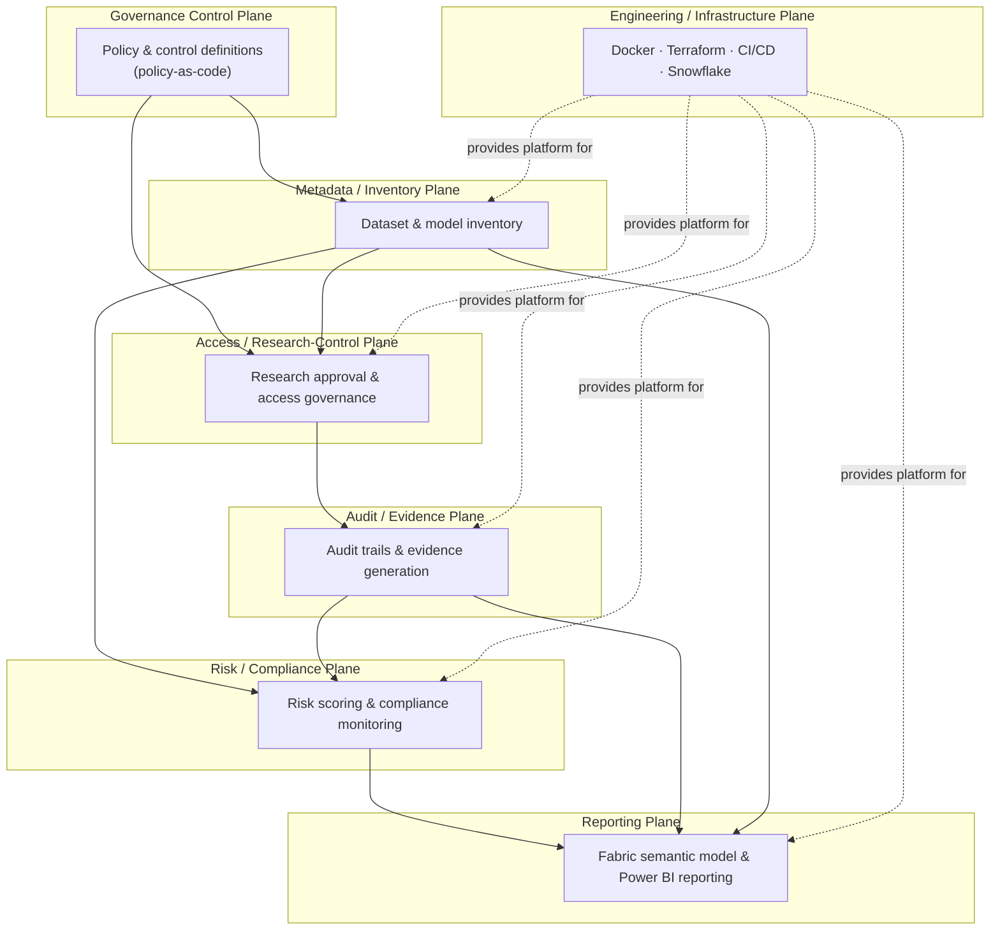

# Platform Architecture

**Status:** Milestone 1 — Platform Foundation. This document describes the target architecture
for the full platform and marks, plane by plane, what exists today versus what is designed but
not yet built. Nothing described as "Planned" should be treated as available.

**Data statement:** the platform is designed to operate on synthetic data only. No real patient
data, no production Snowflake account, no Fabric tenant, and no live cloud infrastructure exist
behind this repository.

## Why seven planes

Healthcare AI governance spans concerns that fail independently and are owned by different
people — a data engineer maintaining inventory metadata does not carry the same responsibility as
a compliance officer reviewing access, and neither owns the reporting layer an oversight
committee reads. Splitting the platform into planes keeps those concerns modular: each plane has
one job, a clear owner, and a boundary that later milestones can implement, test, and deploy
independently without destabilizing the others.

## The seven planes

### 1. Governance control plane

Owns policy and control definitions as code: what a "dataset," a "model," an "approved research
project," and a "control" mean; what rules govern them; what constitutes a violation. Every other
plane reads its definitions from here rather than hard-coding them.

- **Status:** Planned. Only architectural placement and the policy-as-code ADR exist today.

### 2. Metadata / inventory plane

The system of record for datasets and models: what exists, who owns it, its sensitivity
classification, its lineage, and its lifecycle state. This is the plane every other plane joins
against — access decisions, audit records, and risk scores all reference an inventory entity.

- **Status:** Planned. `data/` and `src/governance_platform/inventory/` are scaffolded; no
  synthetic inventory dataset or inventory logic exists yet.

### 3. Access / research-control plane

Governs who may access which dataset or model for which approved research purpose: request
intake, approval workflow, time-bounded grants, and periodic access recertification.

- **Status:** Planned. `src/governance_platform/access/` is scaffolded as a placeholder module.

### 4. Audit / evidence plane

Captures what actually happened — access grants exercised, queries run, models invoked — as an
immutable, queryable trail, and produces the evidence artifacts an auditor or oversight body would
request.

- **Status:** Planned. `src/governance_platform/audit/` is scaffolded as a placeholder module.

### 5. Risk / compliance plane

Scores datasets, models, projects, and access patterns against defined controls and produces a
compliance posture over time, including drift and violation detection.

- **Status:** Planned. `src/governance_platform/risk/` is scaffolded as a placeholder module.
  Responsible AI review criteria are documented in [`governance/responsible_ai.md`](../governance/responsible_ai.md)
  but not automated.

### 6. Reporting plane

Surfaces inventory, access, audit, and risk state to human stakeholders — governance committees,
compliance officers, research leadership — via Fabric and Power BI.

- **Status:** Planned. See [`fabric/semantic_model/README.md`](../fabric/semantic_model/README.md)
  and [`fabric/dashboards/README.md`](../fabric/dashboards/README.md) for the intended design;
  no semantic model or dashboard has been built.

### 7. Engineering / infrastructure plane

The platform everything else runs on: the Python package, containerized local development,
infrastructure-as-code, CI/CD, and the future Snowflake platform that would host governed data
and metadata.

- **Status:** Partially implemented. This is the actual scope of Milestone 1: repository
  structure, Python package skeleton, Docker dev image, restrained Terraform scaffold, CI
  pipeline. See [`infrastructure/`](../infrastructure/) and [`.github/workflows/`](../.github/workflows/).

## Plane relationships

Read top-to-bottom-ish rather than strictly layered: the governance control plane defines the
rules that the inventory and access planes operate under; access activity feeds the audit plane;
inventory and audit state together feed risk/compliance scoring; and audit, inventory, and risk
state are all surfaced through reporting. The engineering/infrastructure plane is the substrate
every other plane deploys onto — it doesn't produce governance data itself.

## Data flow intent (target state, not current state)

1. A dataset or model is registered in the **inventory plane** with an owner and sensitivity
   classification, per rules defined in the **governance control plane**.
2. A researcher requests access for an approved project through the **access plane**; the request
   is evaluated against inventory classification and control policy.
3. Every access grant exercised and every governed action taken is recorded by the **audit
   plane** as an immutable event.
4. The **risk/compliance plane** periodically scores inventory entities, access patterns, and
   audit history against defined controls, surfacing violations and drift.
5. The **reporting plane** aggregates inventory, access, audit, and risk state into governance
   dashboards for oversight stakeholders.
6. All of the above runs on infrastructure provisioned and operated by the **engineering /
   infrastructure plane** — currently a local Python package, a dev container, and CI; Snowflake
   and Fabric are documented intentions, not live systems.

## Related documents

- [`docs/architecture/decisions/`](../docs/architecture/decisions/) — ADRs behind these choices
- [`governance/`](../governance/) — operating-model documentation per governance domain
- [`infrastructure/snowflake/`](../infrastructure/snowflake/) — intended Snowflake responsibilities
- [`fabric/`](../fabric/) — intended Fabric/Power BI reporting architecture
